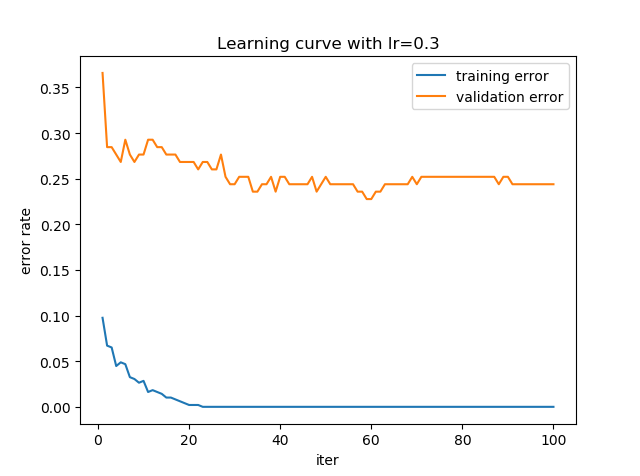
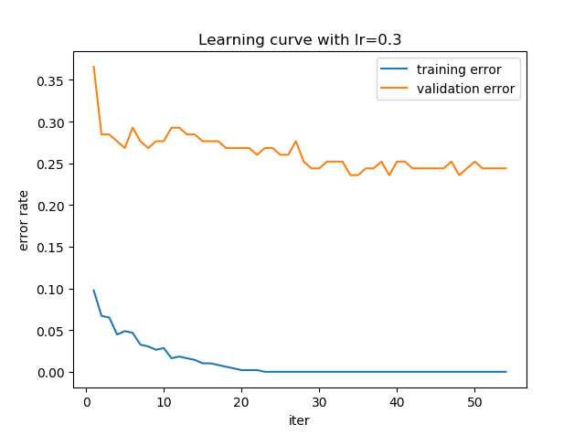
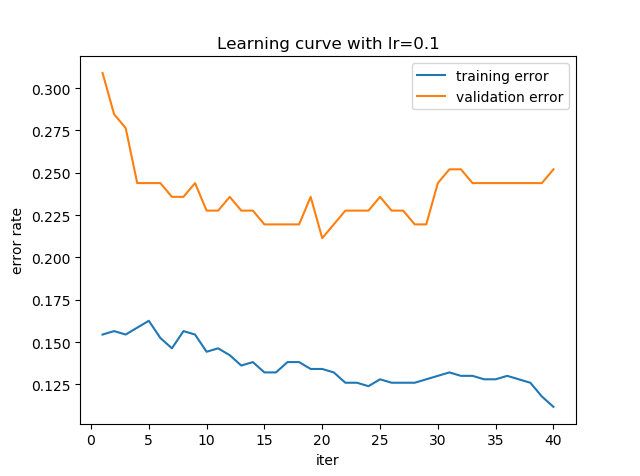

## 实验三——XGBoost

姓名：刘威

学号：PB18010469


## 实验目的

+ 了解XGBoost的原理，体会集成方法在机器学习中的应用。
+ 实现XGBoost的主要功能


## 实验原理

### 提升树

给定一个预测问题，我们已经在这个数据上训练了一个模型，但是这个模型的误差可能比较大，我们可以基于这个模型的预测进行提升, 即再训练一个新的模型去拟合前一个模型中没有拟合到的部分，如果这个模型拟合完后误差仍然很大，则可以继续做下去，直到误差满足我们的需求。在XGBoost中，前述的每个“模型”都是一颗树，称之为提升树。下面我们给出形式化描述。

给定一个数据集 $\mathcal{D}=\{(x_{i},y_{i})\mid x_{i}\in \mathbb{R}^{p},y_{i}\in \mathbb{R},1\le i\le m\}$.

假设我们在这个数据集上已经训练好了 $K$ 颗树，第 $k$ 棵树用映射 $f_{k}:\mathbb{R}^{p}\to\mathbb{R}$ 表示，则第 $i$ 个样本的预测值为:
$$
\hat{y}_{i}=\sum_{k=1}^{K}f_{k}(x_{i}):=\phi(x_{i}),f_{k}\in\mathcal{F}
$$
这里 $\mathcal{F}=\{f(x)=w_{q(x)}\}$（$q:\mathbb{R}^{m}\to \{1,2,\cdots,T\}$, 表示 $x$ 所属的叶子结点，与 CART中的含义相近. 其中 T 表示树的叶子结点数）

记 $\hat{y}_{i}^{(0)}=0$, 前 $t-1$ 轮训练的 $t-1$ 颗树的产生的预测值为 $\hat{y}_{i}^{t-1}$. 在训练第 $t$ 颗树时，我们希望它尽可能拟合前 $t-1$ 颗树的残差，即 $f_{t}(x_{i})\sim y_{i}-\hat{y}_{i}^{t-1}$. 从而得到第 $t$ 轮的预测值为
$$
\hat{y}_{i}^{(t)}=\hat{y}_{i}^{(t-1)}+f_{t}(x_{i}),t=1,2,\cdots,K
$$
下面介绍每一颗树的学习方法（训练过程）

### 学习方法

为了训练每一颗树，我们需要定义一个目标函数. 在 XGBoost 中, 目标函数定义如下：
$$
\mathcal{L}(\phi)=\sum_{i=1}^{m}l(,y_{i},\hat{y}_{i})+\sum_{k=1}^{K}\Omega(f_{k})
$$
其中, $l$ 是某个损失函数，$\Omega$ 定义如下：
$$
\Omega(f)=\gamma T+\frac{1}{2}\lambda\|w\|^{2}
$$
在训练的第 $t$ 轮，我们已经知道了前 $t-1$ 轮的预测值 $\hat{y}_{i}^{(t-1)}$, 目标函数可以写为
$$
\mathcal{L}^{(t)}=\sum_{i=1}^{m}l(y_{i},\hat{y}_{i}^{t-1}+f_{t}(x_{i}))+\Omega(f_{t})
$$
优化上述目标函数，即可达到我们的目的： $f_{t}(x_{i})\sim y_{i}-\hat{y}_{i}^{t-1}$.

利用二阶泰勒展开近似：
$$
\mathcal{L}^{(t)}\approx\sum_{i=1}^{m}[l(y_{i},\hat{y}_{i}^{t-1})+g_{i}f_{t}(x_{i})+\frac{1}{2}h_{i}f_{t}^{2}(x_{i})]+\Omega(f_{t})
$$
其中 $g_{i}=\partial_{\hat{y}^{(t-1)}}l(y_{i},\hat{y}_{i}^{(t-1)}),h_{i}=\partial^{2}_{\hat{y}^{(t-1)}}l(y_{i},\hat{y}_{i}^{(t-1)})$ 分别是损失函数的一阶梯度和二阶梯度.

去掉与第 $t$ 轮训练无关的常数项，还可以进一步简化为
$$
\mathcal{L}^{(t)}\approx\sum_{i=1}^{m}[g_{i}f_{t}(x_{i})+\frac{1}{2}h_{i}f_{t}^{2}(x_{i})]+\Omega(f_{t})
$$
定义 $I_{j}=\{i|q(x_{i})=j\}$, 表示在 $j$ 个叶子结点的样本下标集合. 将 $\Omega$ 带入上式我们可以得到
$$
\begin{aligned}
\mathcal{L}^{(t)}&=\sum_{i=1}^{m}[g_{i}f_{t}(x_{i})+\frac{1}{2}h_{i}f_{t}^{2}(x_{i})]+\gamma T+\frac{1}{2}\lambda\|w\|^{2}\\
&=\sum_{j=1}^{T}[(\sum_{i\in I_{j}}g_{i})w_{j}+\frac{1}{2}(\sum_{i\in I_{j}}h_{i}+\lambda)w_{j}^{2}]+\gamma T
\end{aligned}
$$
对于固定的树结构 $q(x)$, 可求得最优值
$$
w_{j}^{*}=-\frac{\sum_{i\in I_{j}}g_{i}}{\sum_{i\in I_{j}}h_{i}+\lambda}
$$

$$
\mathcal{L}^{t}_{min}(q)=-\frac{1}{2}\sum_{j=1}^{T}\frac{(\sum_{i\in I_{j}}g_{i})^{2}}{\sum_{i\in I_{j}}h_{i}+\lambda}+\gamma T
$$

在实际中，我们不可能枚举所有可能的树结构 $q$, 一个贪心的算法是以一个根节点开始，每次选取一个使得上述目标函数减小量最大的分裂点，将结点一分为二. 假设在某个结点处包含的样本下标集为 $I$, 经过分裂后，左孩子和右孩子包含的样本下标集分别为 $I_{L},I_{R}$，则目标函数减小量为
$$
\mathcal{L}_{split}=\frac{1}{2}\left[\frac{(\sum_{i\in I_{L}}g_{i})^{2}}{\sum_{i\in I_{L}}h_{i}+\lambda}+\frac{(\sum_{i\in I_{R}}g_{i})^{2}}{\sum_{i\in I_{R}}h_{i}+\lambda}-\frac{(\sum_{i\in I}g_{i})^{2}}{\sum_{i\in I}h_{i}+\lambda}\right]-\gamma
$$
我们在选取候选分裂点时，以该减小量为准则，选取该值最大的分裂点.

具体的寻找分裂点的算法如下：


利用此算法我们可以不断地分裂结点，直到 $\mathcal{L}_{split}$ 低于一定阈值. 分裂停止时，我们便学习到了第 $t$ 颗树. 按照同样的方法，学习完所有 $K$ 颗树，整个模型的学习就结束了.

## 实验结果


### 实验源码

为了实现 XGBoost, 首先需要实现其子树结构，子树结构的框架如下：

```python
class TreeNode(object):	# 树结点结构
    def __init__(self, indices):
        self.indices = indices  # 每个结点包含的样本下标集合
        self.isleaf = False  # 是否为叶子结点
        self.split_k = None  # 分裂点选取的特征
        self.split_v = None  # 分裂点选取的特征的值
        self.score = None  # 仅对叶子结点有效，结点的权值
        self.left = None  # 左孩子结点
        self.right = None  # 右孩子结点

class BaseTree(object):
    __X = None	# 类变量，为所有实例共有，这样所有的树可以共享
    __y = None	# 减少空间开销
    
    @staticmethod
    def set_data(X: np.ndarray, y: np.ndarray):
        """
        通过类设置共享的数据 __X，__y
        """
        pass
   	
    def __init__(self, objective, max_depth, gamma, reg_lambda, subsample, colsample, seed):
        """
        参数依次表示: 损失函数，树最大深度，叶子结点数正则化系数gamma，二次正则化项系数lambda, 样本采样比例，特征采样比例，随机种子
        """
        pass
    
    def fit(self, current_y: np.ndarray):
        """
       	已知前面已有的输出current_y，学习当前这颗树
        """
      	pass
    
    def predict(self, X: np.ndarray):
        """
        返回当前这颗树的输出
        """
   	
    def __split(self, indices):
        """
        按照分裂算法对样本集indices进行分裂，如果分裂增益大于阈值，返回分裂点和分裂后左右孩子各包含的样本集，否则返回分裂失败
        """
       	pass
    
    def __construct(self, node: TreeNode, depth: int):
        """
        以node为根结点采取递归方式构建树,如果node不再分裂，将node标记为叶结点，并计算其权重.
        depth参数用于控制树的深度
        """
        pass
```

然后在主模型中迭代地构建若干颗子树，主模型提供了若干可以调节的参数，体现了XGBoost使用的若干关键技术，接口名称与官方实现基本一致. 主模型框架为：

```python
class XGBoost(object):
    def __init__(self,
                 n_estimators: int,
                 max_depth: int = 6,
                 learning_rate: float = 0.3,
                 objective: Union[str, Callable[[np.ndarray, np.ndarray], Tuple[float, float]]] = 'binary:logistic',
                 gamma: float = 0,
                 reg_lambda: float = 1.0,
                 subsample: float = 1.0,
                 colsample: float = 1.0,
                 random_state: Optional[int] = None):
        """
        n_estimators: 子树棵树，迭代次数
        max_depth: 每颗子树的最大允许深度
        learning_rate: 学习率，与shrinkage技术有关，详见原论文
        objective: 损失函数
        gamma: 控制叶结点个数的正则化系数
        reg_lambda: 二次正则化系数
        subsample: 构建每颗树时使用的样本比例
        colsample: 构建每颗树时寻找分裂点时考虑的特征比例，参考random forest中的技术
        random_state: 随机种子        
        """
        pass

  	def fit(self,
            X: np.ndarray,
            y: np.ndarray,
            eval_set: Optional[Tuple[np.ndarray, np.ndarray]] = None,
            early_stopping_rounds: Optional[int] = None):
        """
        X,y: 拟合数据(X,y)
        eval_set: 评估训练过程中模型的泛化能力
        early_stopping_rounds：如果使用了eval_set, early_stopping_rounds用于控制模型的早停，当模型在eval_set上的损失连续 `early_stopping_rounds` 次迭代都没有降低，则停止迭代，并把损失最低的那次迭代次数记为最佳迭代次数
        """
        pass

  	def predict(self, X: np.ndarray, raw=False):
        """
        X: 预测X的输出
        raw: 当进行分类任务时，raw置为True将返回未经过logistic函数转换的原始预测结果
        """
   		pass
    
    def plot_learning_curve(self):
        """
        绘制学习曲线，便于调整超参数，防止过拟合
        """
    	pass

    def __getObj(self, objective):
        """
        return obj function
        if objective is str:
        	return corresponding default obj
       	else if objective is Callable:
       		return objective
       	else:
       		raise error
        """
        pass
        
  	def __update_err(self, ytrue, ypred, which='train'):
        """
        updating error during traing
        """
        pass
```

其中损失函数实现了两种，一种是二分类任务默认的logistic损失函数：

```python
def obj(ytrue, ypred):
    """
    logistic loss function
    """
    ypred = 1. / (1. + np.exp(-ypred))
    grad = ypred - ytrue
    hess = ypred * (1 - ypred)
    return grad, hess
```

另一种是回归任务默认的平方损失函数：

```python
def obj(ytrue, ypred):
    """
    squared error loss funtion
    """
    return 2 * (ypred - ytrue), 2
```

### 模型效果

在模型训练之前，先将提供的训练集按照 `8:2` 划分为训练集和验证集，以便根据模型在验证集上的效果对模型的参数进行调节。

```python
# split train data into train and eval data
m, p = x_train_.shape
np.random.seed(123)
indices = np.arange(m)
np.random.shuffle(indices)
x_train = x_train_[indices[:round(0.8 * m)]]
y_train = y_train_[indices[:round(0.8 * m)]]
x_eval = x_train_[indices[round(0.8 * m):]]
y_eval = y_train_[indices[round(0.8 * m):]]
```

模型可以调节的参数如下：

```python
XGBoost(n_estimators: int,
        max_depth: int = 6,
        learning_rate: float = 0.3,
        objective: Union[str, Callable[[np.ndarray, np.ndarray], Tuple[float, float]]] = 'binary:logistic',
        gamma: float = 0,
        reg_lambda: float = 1.0,
        subsample: float = 1.0,
        colsample: float = 1.0,
        random_state: Optional[int] = None)
```

其中默认参数参考了官方实现给出的默认参数。


#### 使用默认参数

若直接采用这些默认参数，并设置`n_estimators=100,random_state=123`. 训练完100后，分别计算模型在训练集、验证集和测试集上的精确度，并画出学习曲线，得到的结果如下：

```powershell
train acc = 1.0
eval acc = 0.7560975609756098
test acc = 0.7189542483660131
```



可以看到，模型已经完全拟合了训练集，然而在测试集上的效果很差，同时从学习曲线也可以看到，模型训练发生了过拟合。下面设置/调节部分参数来减轻过拟合。


#### 模型早停

在`XGBoost.fit`方法中，提供了 `early_stopping_rounds` 这一可选参数，这一参数同样是参考了官方库提供的接口。使用这一参数可以控制模型提前结束训练。当模型在 `eval_set` 上的损失连续`"early_stopping_rounds"` 轮都不再降低时，即停止训练，并将模型的最佳迭代轮数记为在 `eval_set` 上损失最低那次迭代轮数。

下面我们在使用默认参数的基础上设置 `early_stopping_rounds=20`，训练完成后，分别计算模型在训练集、验证集和测试集上的精确度，并画出学习曲线，得到的结果如下：

```powershell
train acc = 1.0
eval acc = 0.7642276422764228
test acc = 0.7189542483660131
```



可以看到，提前停止训练对减轻过拟合的作用不明显，测试集上的误差仍然很低。需要对模型的结构和训练参数进行调整。


#### 正则化与随机采样

为了减轻模型的过拟合程度，我们需要简化模型的结构，同时要尽可能使得每棵树的结构差异性比较大。

为简化模型结构，我们可以控制正则化项参数来控制模型的复杂性。一者可以通过 `max_depth` 控制树的深度，二者可以通过 `gamma` 控制叶子结点的数目，三者可以通过 `reg_lambda` 控制叶子结点的权值.

为使得每棵树的结构差异性比较大，我们可以使用随机化技术：行采样与列采样。`subsample` 可以控制行采样的比例，即每次选择一定比例的样本构建提升树，而不是全部样本；`colsample` 可以控制列采样的比例，即每次构建树时只使用一定比例的特征去划分结点, 而不是全部特征。

调节这些参数，并使用`early_stopping_rounds=20`，使得模型在验证集上的体现的泛化能力尽可能好。最终的参数设定如下：

```python
XGBoost(n_estimators=200, max_depth=5, learning_rate=0.1, objective='binary:logistic', gamma=0, reg_lambda=3, subsample=1, colsample=0.7, random_state=123)
```

在上述参数设定下，训练完成后，分别计算模型在训练集、验证集和测试集上的精确度，并画出学习曲线，得到的结果如下：

```powershell
train acc = 0.8658536585365854
eval acc = 0.7886178861788617
test acc = 0.7450980392156863
```



可以看到，使用了这些技术后，过拟合的确减轻了一些，模型在测试集上的效果有所提升。


## 实验总结

本实验实现的XGBoost 模型效果很好，拟合能力很强，能够完全拟合训练集。同时，计算效率也很高，使用所有的训练集和特征训练100颗深度为6的树，也只用大概3秒的时间。

然而，XGBoost 模型很容易过拟合训练集，在数据量较少时，难以去学习到泛化能力高的模型。因此，如果测试集与训练集的分布略有差异，模型即使能够在训练集上的达到“完美”的效果，也很可能在测试集上取得很差的结果。本实验提供的数据集较小，因此得到的实验结果也可以接受。